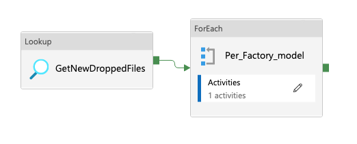
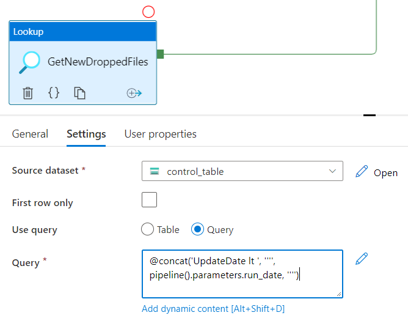

# sample-mdw-serverless

End to end sample of data processing to be viewed in pbi

## Use Case

Contoso is an organization with multiple factories and multiple industrial lines. The factories need to upload data periodically. The data is constructed of zipped JSON lines:

```json
{"dataModelName":"data_model_1","operation":"U","data":{"factory":1354010702,"lineId":14874,"date":"2022-06-23T00:00:00"}}
{"dataModelName":"data_model_1","operation":"U","data":{"factory":1354010702,"lineId":14777,"date":"2022-06-23T00:00:00"}}
{"dataModelName":"data_model_1","operation":"U","data":{"factory":1354010702,"lineId":14939,"date":"2022-06-23T00:00:00"}}
{"dataModelName":"data_model_1","operation":"U","data":{"factory":1354010702,"lineId":14793,"date":"2022-06-23T00:00:00"}}
```

Contoso already developed a component named ControlBox, its capabilities (out of scope for this sample) are:

- Authenticate and authorize factories.

- Provide factories with SAS token, used by the factory to upload periodic data.

- Register new data uploaded in a control table.

Contoso is looking for cost-effective solution, which will be able to provide Contoso Analytical team better view of the data.

## Architecture

The following diagram illustrates the solution suggested (and implemented) by Contoso. It leverages serverless computing for data movement, cleansing, restructure and reporting.


### Control Table

A control table is used to store relevant information about the data uploaded into browse layer. This information will be used to know the location of all the uploaded files per factory and industrial line as well as uploaded date. Every time a new file lands in bronze layer this table is automatically updated by another process (out of scope for this sample).

FactoryID | LineID | FileLocation | UpdateDate | Processed
---|---|--- |--- |---
1354010702 | 14874 | factory=1354010702/line=14874/y=2022/m=06/d=25| 2022-06-25 | false
1354010702 | 14834 | factory=1354010702/line=14874/y=2022/m=06/d=25| 2022-06-25 | true
1353534654 | 35634 | factory=1353534654/line=35634/y=2022/m=06/d=26| 2022-06-26 | true
... | ... | ... | ... | ...

In this sample, the control table was stored in a JSON file.

>Note: Manual edit to the control JSON file can be done directly from the portal.

### Bronze to Silver

The data from the different factories lands in the same storage account. Consoso has a container per layer of a Medallion architecture, bronze, silver and gold. Inside each container there is a folder per factory, per data model and per date. See the following example: Contoso/bronze/factory=1782/dataModelName=data_model_1/y=2022/m=07/d=24

In the Synapse workspace, a Lookup activity will query the control table and filter the entries to process.
The lookup activity output will be used as Items of a ForEach activity to iterate over all factories and all its industrial lines. For each factory and data model we will apply the relevant business logic.



#### Read the data

##### Linked service

In Synapse, when reading data from the storage account, we must configure a linked service as a source. This will read data in. To configure this, we must create a query of the data we want to read in.

Create a linked service to read the zipped multi line JSON files.

##### Get relevant files from bronze into Synapse Analytics

The following pipeline parameters were created:

- pipeline.factory_id (not sure if possible)
- pipeline.data_model_id (not sure if possible)
- pipeline.run_date

These parameters will be populated manually before triggering the pipeline run and will be used in the Lookup activity Query to filter the relevant entries from the control table for each pipeline run.



#### Transform the data

To keep this sample more generic, we will skip any data manipulation and will just copy the data from bronze to silver layer. A Copy() activity will be defined inside a ForEach() activity that will iterate over the output of the Lookup() activity, ```@activity('GetNewDroppedFiles').output.value```.

> As for time, in order to extract the nested JSON values you will have to map these values to a type in the Mapping tab of the Copy() activity.  

#### Write the data

Create a linked service to the silver container and save the data in a parquet format and keep the originL directory structure and file names.

The parquet files can be queried using Synapse Serverless SQL Pool. See the following example:

```sql
select * 
FROM
    OPENROWSET(
        BULK 'https://<storage-account-name>.dfs.core.windows.net/<container>/<folder>/**',
        FORMAT = 'PARQUET'
    ) AS [result]
```

### Silver to Gold

As described in this [document](https://docs.microsoft.com/en-us/azure/synapse-analytics/sql/develop-tables-cetas) there are few initialization activities. In the following sections Serverless SQL pool is used.

#### Create a Database, master key & scoped credentials

```sql
-- Create a DB
CREATE DATABASE <db_name>
-- Create Master Key (if not already created)
CREATE MASTER KEY ENCRYPTION BY PASSWORD = '<password>';
-- Create credentials
CREATE DATABASE SCOPED CREDENTIAL [factories_cred]
WITH IDENTITY='SHARED ACCESS SIGNATURE',  
SECRET = ''

```

In order to create SAS token, you can follow this [document](https://docs.microsoft.com/en-us/azure/cognitive-services/translator/document-translation/create-sas-tokens?tabs=Containers). Alternate solution in case you want one scoped credentials that can be used for the entire storage account. This can be created using the portal as well:

- Click on 'Shared Access Signature' in the Security + Networking blads:


- Select required operation, IP restrictions, dates etc:


#### Create External File format

The following statement needs to be executed once per workspace:

```sql
IF NOT EXISTS (SELECT * FROM sys.external_file_formats WHERE name = 'SynapseParquetFormat') 
    CREATE EXTERNAL FILE FORMAT [SynapseParquetFormat] 
    WITH ( FORMAT_TYPE = PARQUET)
GO
```

#### Create External Source

The following is creating an external data source, which will host the gold tables.

```sql
IF NOT EXISTS (SELECT * FROM sys.external_data_sources WHERE name = 'gold') 
    CREATE EXTERNAL DATA SOURCE [gold] 
        WITH (
            LOCATION = 'abfss://<gold container>@<storage account>.dfs.core.windows.net' 
        )
GO
```

#### Create external table

Finally lets make use of the resources and data created, by creating the external table, this sample is essentially coping the entire content of all parquet files into a single table, this is the place where additional aggregations, filtering can be applied.

```sql
CREATE EXTERNAL TABLE table_name
    WITH (
        LOCATION = '<specific location within the gold container>/',  
        DATA_SOURCE = [gold],
        FILE_FORMAT = [SynapseParquetFormat]  
)
    AS 
    select * 
    FROM
    OPENROWSET(
        BULK 'https://<storage account>.dfs.core.windows.net/<silver container>/<folder>/**',
        FORMAT = 'PARQUET'
    ) AS [result]

```

After this activity is completed, you can access the table using the serverless SQL pool, or from [Power BI](https://docs.microsoft.com/en-us/power-apps/maker/data-platform/export-to-data-lake-data-powerbi#prerequisites).

## Working with this sample

As part of the sample we included bicep code, which will create the minimum required resources for it to run.

1. You are expected to create a resource group in which resources would be created.

2. Clone (or fork) this repository.

3. Edit ```deploy/bicep/param.json``` and provide your values, they should be self explained.

4. Run ```azurecli
az deployment group create --resource-group <your rg name> --template-file main.bicep --parameters @param.json```

5. Open the newly created Synpase workspace, it should open without errors. There should two linked ADLS Gen2 items, one is the storage account named ```medalionsynapse<suffix>```.

6. Point your workspace to the cloned/forked repository. [see document](https://docs.microsoft.com/en-us/azure/synapse-analytics/cicd/source-control).

7. Modify the linked services parameter to reflect real values - it is the same value from the bicep ```param.json``` file named ```suffix```. Once you update it as part of the linked service name ```medalion_storage``` it would be reflected in all affected integration datasets.
