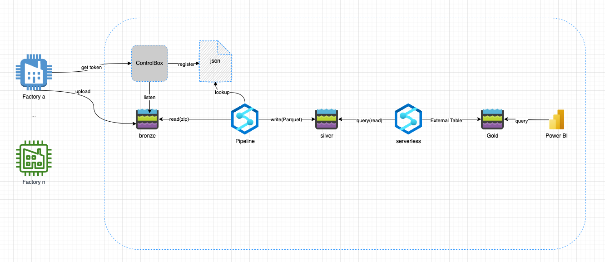
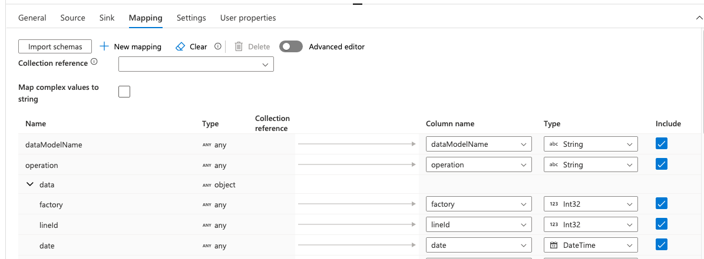

# sample-mdw-serverless

End to end sample of data processing to be viewed in pbi

## Use Case

Contoso is an organization with multiple factories and multiple industrial lines. The factories need to upload data periodically.

Contoso already developed a component named ControlBox, its capabilities (out of scope for this sample) are:

- Authenticate and authorize factories.

- Provide factories with SAS token, used by the factory to upload periodic data.

- Register new data uploaded in a control table.

Contoso is looking for cost-effective solution, which will be able to provide Contoso Analytical team better view of the data.

## Architecture

The following diagram illustrates the solution suggested (and implemented) by Contoso. It leverages serverless computing for data movement, cleansing, restructure and reporting.



## Working with this sample

As part of the sample we included bicep code, which will create the minimum required resources for it to run.

1. You are expected to create a resource group in which the resources would be created.

2. Clone or fork this repository.

3. Edit ```deploy/bicep/param.json``` file and provide your values, they should be self explained.

    > Note: The ```suffix``` will be used to create the synapse and the storage instances with a unique namespace in Azure. If the suffix is already in use, please choose another one.

4. Open a command line, go to  'sample-mdw-serverless/deploy/bicep' and run ```az deployment group create --resource-group <your rg name> --template-file main.bicep --parameters @param.json``` on the 'bicep' folder. This operation may take a few minutes to complete.
    > Prerequisites: You must have [Azure CLI](https://docs.microsoft.com/en-us/dotnet/azure/install-azure-cli) and [Bicep](https://docs.microsoft.com/en-us/azure/azure-resource-manager/bicep/install) installed in your machine.

5. Open the newly created Synapse workspace.

6. Point the Synapse workspace to the cloned/forked repository as shown in this [document](https://docs.microsoft.com/en-us/azure/synapse-analytics/cicd/source-control).

7. In the workspace, go to theManage > Linked Services > medallion_storage > Parameters > suffix and the same value you gave in the bicep ```param.json```. Once you update it would be reflected in all affected integration datasets.

    

8. Run the 'Copy Data Samples' pipeline. This will copy the control file and the data samples to your local repository. [See details.](#sample-files)

9. Run the 'Process Factories Data'. This will run the Bronze to Silver transformations per factory and per data model. [See details.](#bronze-to-silver)

10. Go to and Develop > SQL Scrips > Factories and open the ```InitDB``` script.

11. Run the first commands against the ```master``` database.

12. Run the remaining commands by order against the newly created DB. [See details.](#silver-to-gold)

13. Open the ```Create-External-Tables``` script, replace the ```suffix``` with the one used throughout the sample and the SAS token to access your storage account. Run the commands by order.

14. Open Power BI Desktop and follow the steps in this [document](https://docs.microsoft.com/en-us/power-apps/maker/data-platform/export-to-data-lake-data-powerbi#prerequisites) to connect your Gold Data Lake storage to Power BI Desktop.

## Details

### Sample files

The sample files consist of daily dropped data in zip format. Each zip file contains a data file with a JSON per line.

```JSON
{"dataModelName":"data_model_1","operation":"I","data":{"factory":1354010702,"lineId":15025,"date":"2022-06-24T00:00:00","feature1":0,"dim":0,"yield":5223}}
{"dataModelName":"data_model_1","operation":"I","data":{"factory":1354010702,"lineId":15027,"date":"2022-06-24T00:00:00","feature1":0,"dim":0,"yield":865}}
{"dataModelName":"data_model_2","operation":"U","data":{"factory":1354010702,"lineId":15043,"date":"2022-06-25T00:00:00","feature1":0,"dim":0,"yield":235}}
{"dataModelName":"data_model_2","operation":"U","data":{"factory":1354010702,"lineId":15045,"date":"2022-06-25T00:00:00","feature1":0,"dim":0,"yield":325    0}}
```

### Control Table

A control table is used to store information about the data uploaded into browse layer. This table stores the location of all the uploaded files per factory, the data model, uploaded date and if the file was already processed or not.

FactoryID | DataModelName | FileLocation | UpdateDate | Processed
---|---|--- |--- |---
1354010702 | data_model_1 | factory=1354010702/dataModelName=data_model_1/y=2022/m=06/d=25| 2022-06-25 | false
1354010702 | data_model_2 | factory=1354010702/dataModelName=data_model_2/y=2022/m=06/d=25| 2022-06-25 | true
1353534654 | data_model_1 | factory=1353534654/dataModelName=data_model_1/y=2022/m=06/d=26| 2022-06-26 | true
... | ... | ... | ... | ...

Every time a new file lands in bronze layer this table must be automatically updated by another process (out of scope for this sample).

>Note: To keep this sample simple, the control information was hardcoded in a JSON file named dropped_files.json (manual edit to the control JSON file can be done directly from the portal). However, for production this is an anti-pattern and we strongly advise using a metadata table and a process to automatically update it when a new file lands in bronze and when a file is processed.

### Bronze to Silver

The data from the different factories lands in the same storage account. The storage account has a container per layer of a Medallion architecture, bronze, silver and gold. Inside each container there is a folder per factory, per data model and per date. See the following example:

Contoso/bronze/factory=1782/dataModelName=data_model_1/y=2022/m=07/d=24

In the Synapse workspace, a Lookup activity will read the control table information.
There is a ForEach() per data model that will iterate over all factories with unprocessed files. For each factory and data model the relevant business logic should be applied. To keep this sample more generic, the files are just copied from bronze to silver in a parquet format.


Inside each ForEach() activity, there is a IfCondition() activity which filters the unprocessed data for specific data model.

#### Mapping

Each type of file will have a mapping schema to define what are the types of data to be saved.
While this process might be tedious - you will need to spend time on it, ensuring your mapped fields are with the right type. Addtional fields (e.g calculated/derived) can be added using this tab.



#### Read the data

##### Linked service

In Synapse, when reading data from the storage account, we must configure a linked service as a source. This will read data in. To configure this, we must create a query of the data we want to read in.

Create a linked service to read the zipped multi line JSON files.

#### Transform the data

To keep this sample more generic, we will skip any data manipulation and will just copy the data from bronze to silver layer. A Copy() activity will be defined inside a ForEach() activity that will iterate over the output of the Lookup() activity, ```@activity('GetNewDroppedFiles').output.value```.

> As for time, in order to extract the nested JSON values you will have to map these values to a type in the Mapping tab of the Copy() activity.  

#### Write the data

Create a linked service to the silver container and save the data in a parquet format and keep the originL directory structure and file names.

The parquet files can be queried using Synapse Serverless SQL Pool. See the following example:

```sql
select * 
FROM
    OPENROWSET(
        BULK 'https://<storage-account-name>.dfs.core.windows.net/<container>/<folder>/**',
        FORMAT = 'PARQUET'
    ) AS [result]
```

### Silver to Gold

As described in this [document](https://docs.microsoft.com/en-us/azure/synapse-analytics/sql/develop-tables-cetas) there are few initialization activities. In the following sections Serverless SQL pool is used.

#### Create a Database, master key & scoped credentials

```sql
-- Create a DB
CREATE DATABASE <db_name>
-- Create Master Key (if not already created)
CREATE MASTER KEY ENCRYPTION BY PASSWORD = '<password>';
-- Create credentials
CREATE DATABASE SCOPED CREDENTIAL [factories_cred]
WITH IDENTITY='SHARED ACCESS SIGNATURE',  
SECRET = ''

```

In order to create SAS token, you can follow this [document](https://docs.microsoft.com/en-us/azure/cognitive-services/translator/document-translation/create-sas-tokens?tabs=Containers). Alternate solution in case you want one scoped credentials that can be used for the entire storage account. This can be created using the portal as well:

- Click on 'Shared Access Signature' in the Security + Networking blads:


- Select required operation, IP restrictions, dates etc:


#### Create External File format

The following statement needs to be executed once per workspace:

```sql
IF NOT EXISTS (SELECT * FROM sys.external_file_formats WHERE name = 'SynapseParquetFormat') 
    CREATE EXTERNAL FILE FORMAT [SynapseParquetFormat] 
    WITH ( FORMAT_TYPE = PARQUET)
GO
```

#### Create External Source

The following is creating an external data source, which will host the gold tables.

```sql
IF NOT EXISTS (SELECT * FROM sys.external_data_sources WHERE name = 'gold') 
    CREATE EXTERNAL DATA SOURCE [gold] 
        WITH (
            LOCATION = 'abfss://<gold container>@<storage account>.dfs.core.windows.net' 
        )
GO
```

#### Create external table

Finally lets make use of the resources and data created, by creating the external table, this sample is essentially coping the entire content of all parquet files into a single table, this is the place where additional aggregations, filtering can be applied.

```sql
CREATE EXTERNAL TABLE table_name
    WITH (
        LOCATION = '<specific location within the gold container>/',  
        DATA_SOURCE = [gold],
        FILE_FORMAT = [SynapseParquetFormat]  
)
    AS 
    select * 
    FROM
    OPENROWSET(
        BULK 'https://<storage account>.dfs.core.windows.net/<silver container>/<folder>/**',
        FORMAT = 'PARQUET'
    ) AS [result]

```

After this activity is completed, you can access the table using the serverless SQL pool, or from [Power BI](https://docs.microsoft.com/en-us/power-apps/maker/data-platform/export-to-data-lake-data-powerbi#prerequisites).
